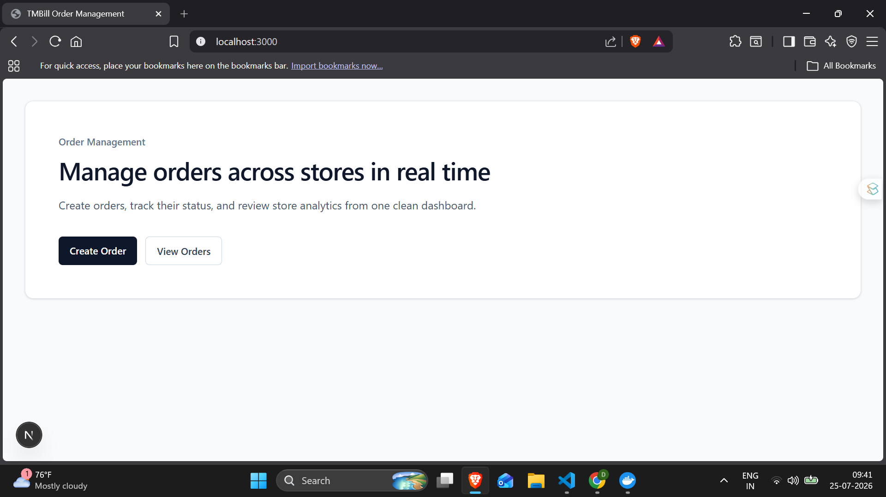
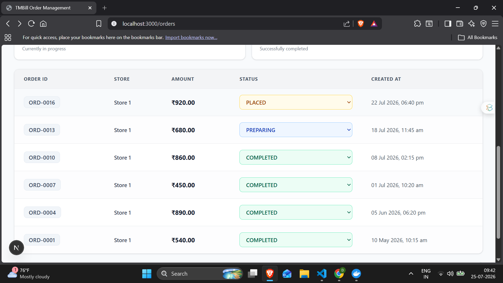
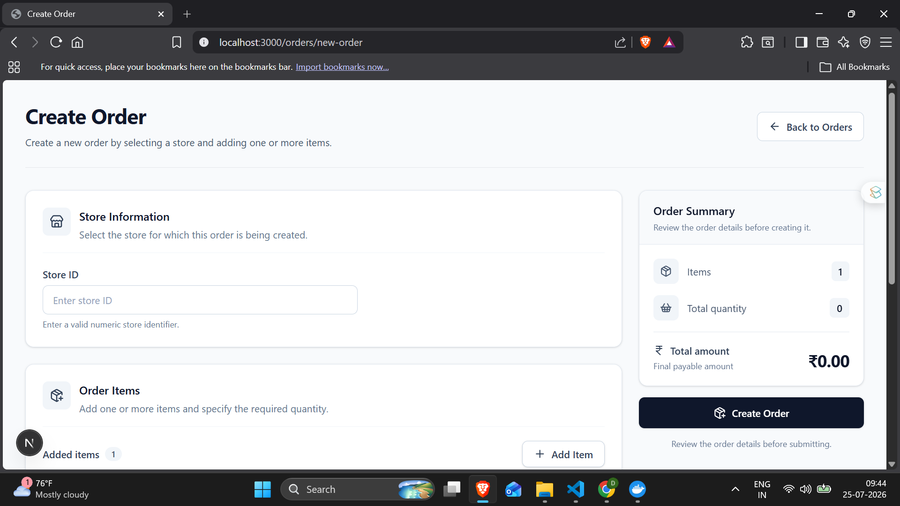
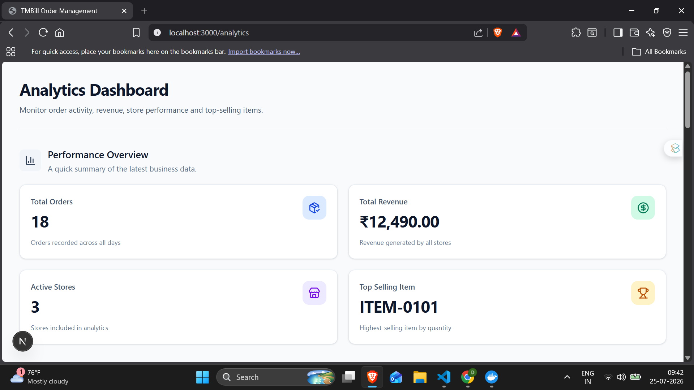

# TMBill Full Stack Developer Assessment

A production-ready **Multi-Store Order Management System** built as part of the **TMBill Full Stack Developer Assessment**.

The application demonstrates a scalable backend architecture, real-time communication using Socket.IO, data archival, analytics, and a responsive Next.js frontend.

---

## Features

### Backend

- Create Orders
- Get Orders with Pagination
- Filter Orders by Store
- Update Order Status
- Request Validation using Zod
- MySQL Transactions
- Repository Pattern Architecture
- Centralized Error Handling
- Real-time Socket.IO Events
- Archive Old Orders
- Analytics APIs

### Frontend

- Orders Dashboard
- Create Order Form
- Paginated Order List
- Order Status Update
- Analytics Dashboard
- Responsive UI
- Loading & Error States
- Real-time Updates

---

# Tech Stack

## Frontend

- Next.js
- React
- JavaScript
- Tailwind CSS
- TanStack Query
- Axios
- React Hook Form
- Socket.IO Client

## Backend

- Node.js
- Express.js
- JavaScript
- Socket.IO
- Zod

## Database

- MySQL 8
- Docker
- Docker Compose

---

# Project Structure

```
TMBill
│
├── client
│   ├── src
│   ├── public
│   └── package.json
│
├── backend
│   ├── src
│   │   ├── config
│   │   ├── controllers
│   │   ├── middlewares
│   │   ├── repositories
│   │   ├── routes
│   │   ├── services
│   │   ├── validations
│   │   └── utils
│   │
│   └── package.json
│
├── docker-compose.yml
└── README.md
```

---

# Backend Architecture

```
Route
   ↓
Zod Validation
   ↓
Controller
   ↓
Service
   ↓
Repository
   ↓
MySQL
```

---

# Database

The project uses four tables.

- orders
- order_items
- orders_archive
- order_items_archive

Indexes

- store_id
- created_at

---

# Getting Started

## 1. Clone Repository

```bash
git clone https://github.com/<your-username>/<repository>.git

cd TMBill
```

---

## 2. Install Dependencies

### Backend

```bash
cd backend
npm install
```

### Frontend

```bash
cd ../client
npm install
```

---

## 3. Configure Environment Variables

### Backend (.env)

```env
PORT=5000

DB_HOST=localhost
DB_PORT=3306
DB_USER=root
DB_PASSWORD=password
DB_NAME=tmbill

CLIENT_URL=http://localhost:3000
```

### Frontend (.env.local)

```env
NEXT_PUBLIC_API_URL=http://localhost:5000/api
NEXT_PUBLIC_SOCKET_URL=http://localhost:5000
```

---

# Docker

Start MySQL

```bash
docker compose up -d
```

Stop MySQL

```bash
docker compose down
```

---

# Run the Application

### Backend

```bash
cd backend

npm run dev
```

Runs on

```
http://localhost:5000
```

---

### Frontend

```bash
cd client

npm run dev
```

Runs on

```
http://localhost:3000
```

---

# API Endpoints

## Orders

| Method | Endpoint | Description |
|---------|----------|-------------|
| POST | `/api/orders` | Create Order |
| GET | `/api/orders` | Get Orders |
| PATCH | `/api/orders/:id/status` | Update Status |

---

## Analytics

| Method | Endpoint |
|---------|----------|
| GET | `/api/analytics/orders-per-day` |
| GET | `/api/analytics/revenue-per-store` |
| GET | `/api/analytics/top-selling-items` |

---

## Archival

| Method | Endpoint |
|---------|----------|
| POST | `/api/archive-old-orders` |

---

# Socket.IO Events

| Event | Description |
|-------|-------------|
| `new_order` | Triggered when a new order is created |
| `order_status_updated` | Triggered when an order status changes |

---

# Project Highlights

- Clean Layered Architecture
- Repository Pattern
- Zod Validation
- MySQL Transactions
- Socket.IO Integration
- Dockerized Database
- Pagination
- Analytics
- Data Archival
- Centralized Error Handling
- Responsive Next.js Frontend

---


# Screenshots

## Dashboard

<p align="center">
  
</p>

---

## View Orders

<p align="center">
  
</p>

---

## Create Order

<p align="center">
  
</p>

---

## Analytics Dashboard

<p align="center">
  
</p>

---

# Future Improvements

- Authentication & Authorization
- Swagger API Documentation
- Unit & Integration Tests
- CI/CD Pipeline
- Redis Caching
- Cloud Deployment (AWS)

---

# Author

**Shreyash Talele**

**MCA Graduate | Full Stack Developer**

GitHub  
https://github.com/shreyashtalele

LinkedIn  
https://www.linkedin.com/in/shreyashtalele

---

## License

This project was developed as part of the **TMBill Full Stack Developer Assessment**.